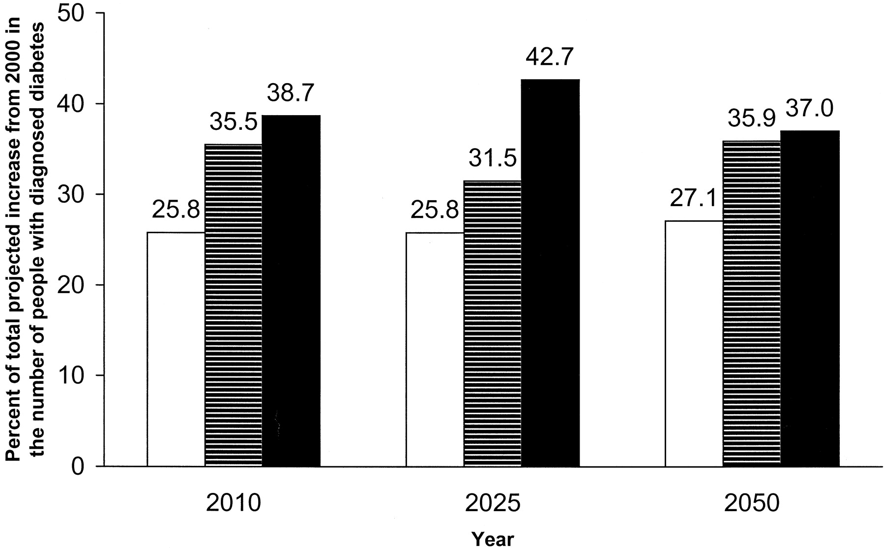

# Module 4 Final Project

# Predicting Hospital Readmission for Diabetic Patients
An Analysis of 100,000 Diabetic patient records in an attempt to identify areas of potential improvement in treatments to improve patient prognosis.

# Motivation
According to a [study](https://care.diabetesjournals.org/content/24/11/1936) published by the American Diabetes Association in 2001, the number of Americans diagnosed with diabetes is projected to increase by 165% by 2050. The study suggests this increase, from 11 million to 29 million affected individuals, would be most significant in individuals >= 75 years old.
 

While this increase itself is concerning when viewed from a human health perspective, it also represents additional logistical complications for the US healthcare system which should also be considered. The unfortunate reality is that hospitals possess limited resources in space, personnel, and time. As hospital costs rise as a product of increasing rates of Diabetes in the population, more hospital resources are required to accomodate patient health needs. The monetary cost of these resources is passed on to insurance companies, and ultimately to the public.

Figure:
Percentage breakdowns of the projected increase in the total number of people with diagnosed diabetes due to population growth, increasing prevalence rates, and demographic changes for the years 2010, 2025, and 2050 (most likely scenario). □, Population growth; [cjs2106], increasing prevalence rates; ▪ demographic changes. [Source](https://care.diabetesjournals.org/content/24/11/1936.article-info)

 

When considering an approach to tackling this issue, an old addage may ring true: "An ounce of prevention is worth a pound of cure." By studying available medical records for Diabetic patients, we might be able to better determine presenting symptoms that might indicate that a patient is "at risk" for readmission. By identifying these symptoms (or collections of symptoms) using Artificial Intelligence, physicians may be better equipped to effectively treat underlying health issues in Diabetic patients, improving long-term patient prognosis. By providing more effective treatment options, we would hope to decrease hospital readmission rates in Diabetic patients worldwide.

 

In this investigation, we'll use a [dataset](http://archive.ics.uci.edu/ml/datasets/Diabetes+130-US+hospitals+for+years+1999-2008) representing 10 years (1999-2008) of clinical care records from 130 US hoptials. The dataset, contains ~100,000 patient encounters meeting the following criteria:

1. It is an inpatient encounter (a hospital admission).
2. It is a diabetic encounter, that is, one during which any kind of diabetes was entered to the system as a diagnosis.
3. The length of stay was at least 1 day and at most 14 days.
4. Laboratory tests were performed during the encounter.
5. Medications were administered during the encounter.

 

The data contains such attributes as patient number, race, gender, age, admission type, time in hospital, medical specialty of admitting physician, number of lab test performed, HbA1c test result, diagnosis, number of medication, diabetic medications, number of outpatient, inpatient, and emergency visits in the year before the hospitalization, etc.

# Notebooks of Interest
1. [Data Scrubbing](/Dataset_Cleaning.ipynb)
2. [Modeling](/Mod_4_Modeling.ipynb)

# Figures of Interest

* Target Variable Class Distribution:

* Dataset Ethnicity Makeup:

* Feature Multicollinearity Assessment before modeling:

* Ensemble Method Feature Importance:

* Code - Final Deep Learning Model, with SMOTE oversampling of minority class:

* Confusion Matrix: Predictive ability of "Final" Deep learning model

# Conclusions

While not achieving the predictive ability hoped prior to the investigation, there are several useful conclusions we can draw.
 

From Keynote:

* In all of the models fitted in this investigation, changes in insulin dosage was among the most significant features in determining whether patient was readmitted.
* Because insulin can be expensive, as much as $700 per month for some patients, according to a WebMD report published in 2019, patients that cannot afford the medication may fail to fill prescriptions given by doctors because they can’t afford them.

 

To improve results in a future study, it is advised to:
* Include income and self-reported insulin dosing regiment in order to more accurately evaluate diabetic patient prognosis.
* Increase size of population by including additional patient records in the database.
* In this investigation, because there were so many different classes for the Diagnosis 1, 2, and 3 features, all were excluded from consideration in modeling. To improve predictive ability, further research should be done to ultilize these features by retaining classes germane to diabetic patient prognosis.
* Attempt to engineer additional features from the dataset to improve model performance.